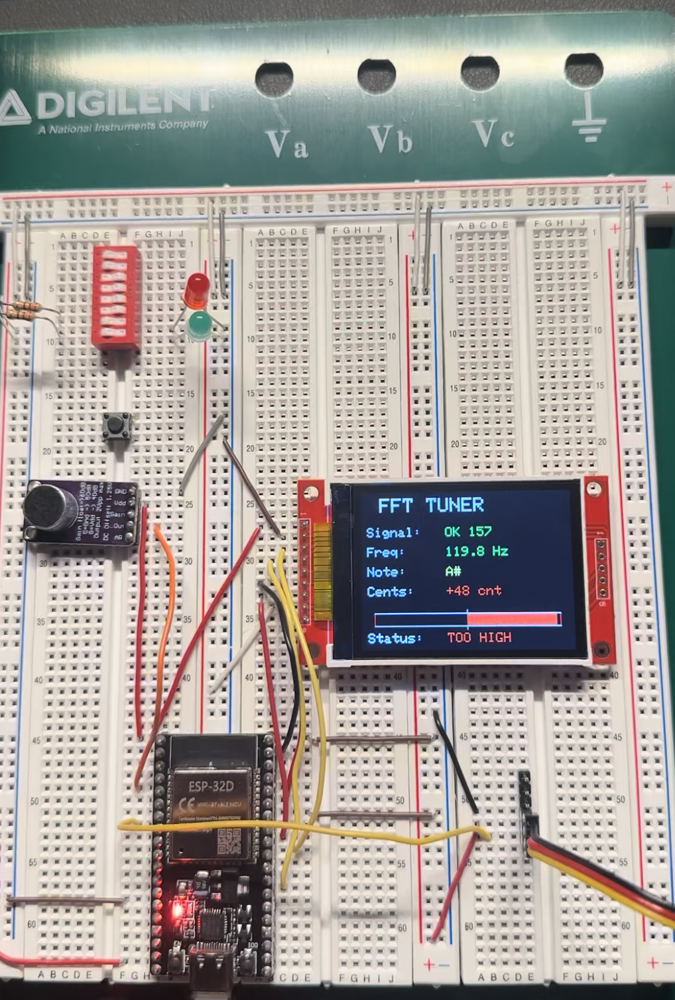
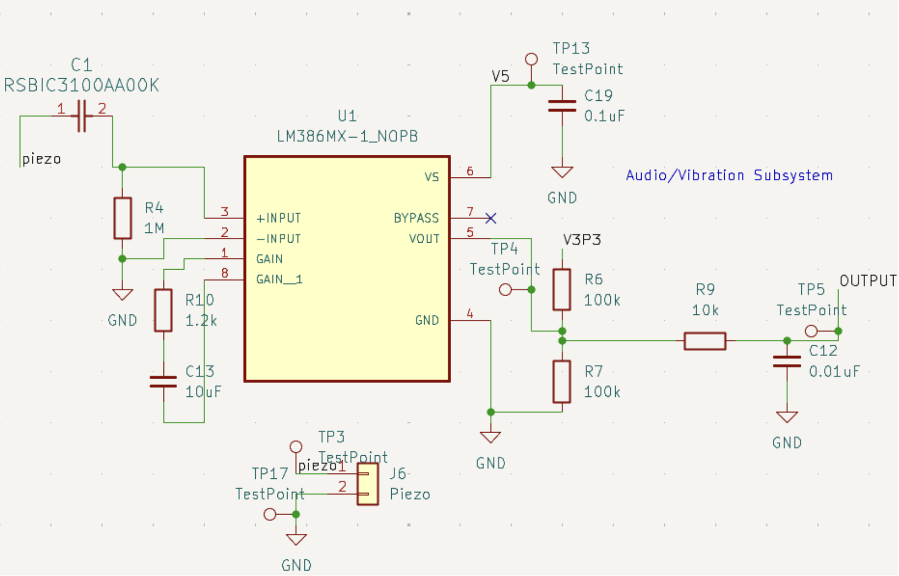
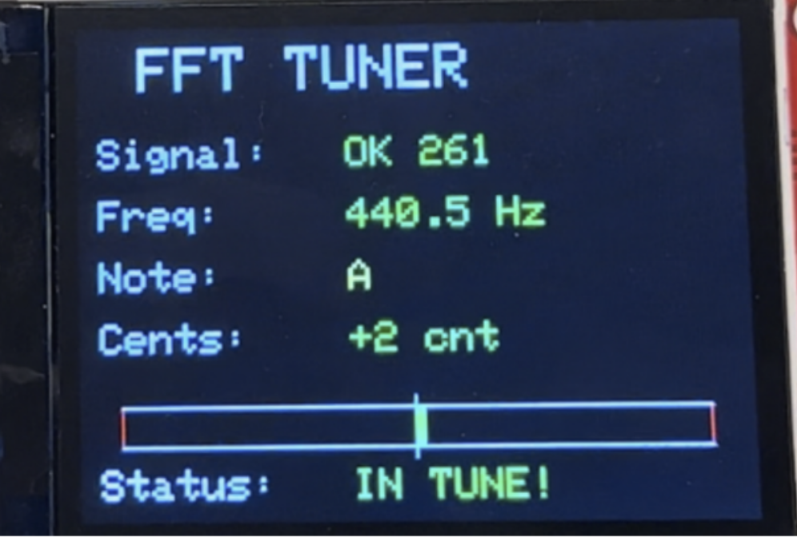
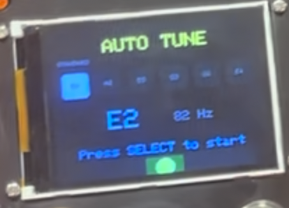
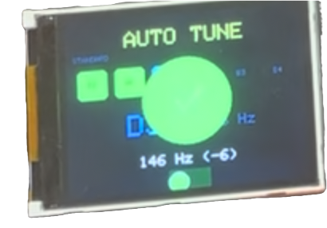
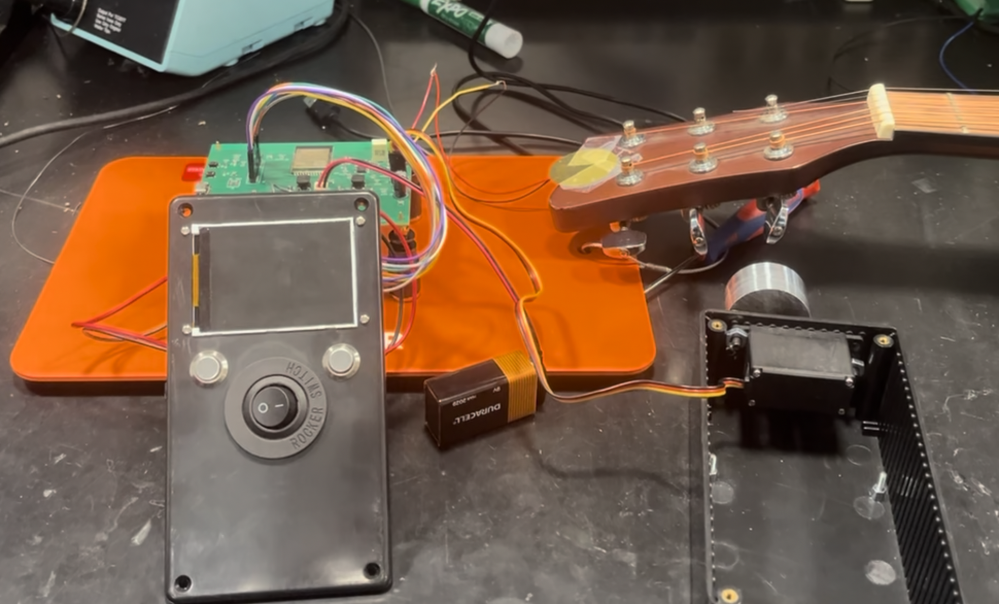

# ECE 445 Senior Design Lab Notebook
## Auto-Guitar Tuner: Personal Notebook

**Name:** Daniel Cho  
**Role:** Software Development (ESP32, Digital Signal Processing, UI)  
**Team:** 25  
**Semester:** Fall 2025


## Table of Contents

- [Week 1](#week-1)
- [Week 2](#week-2)
- [Week 3](#week-3)
- [Week 4](#week-4)
- [Week 5](#week-5)
- [Week 6](#week-6)
- [Week 7](#week-7)
- [Week 8](#week-8)
- [Week 9](#week-9)
- [Week 10](#week-10)
- [Week 11](#week-11)
- [Week 12](#week-12)
- [Week 13](#week-13)
- [Week 14](#week-14)
---
# Week 1

## Project Approval & Role Distribution

**Date:** September 2, 2025

### Objectives

- Attend team formation meeting
- Finalize project selection

### Work Done

Selected the Auto-Guitar Tuner project after discussing several options with the team. The project will automatically tune a guitar by detecting pitch and adjusting tuning pegs with a motor.

Team roles assigned:
- Daniel: Software development — ESP32, DSP, UI
- Ritvik: Hardware development — PCB, Chips, Power
- Tim: Hardware development — PCB, Chips, Motor

---

## Initial Research

**Date:** September 5, 2025

### Objectives

- Begin researching pitch detection methods
- Identify frequency range requirements

### Work Done

Researched pitch detection approaches:

1. **FFT (Fast Fourier Transform):** Converts time-domain signal to frequency spectrum
2. **Autocorrelation:** Finds periodicity by comparing signal with delayed copies

Initial reading suggests autocorrelation may be better for guitar due to strong harmonics.

Guitar standard tuning frequencies I need to detect:
- E2: 82.41 Hz
- A2: 110.00 Hz  
- D3: 146.83 Hz
- G3: 196.00 Hz
- B3: 246.94 Hz
- E4: 329.63 Hz

Detection range: approximately 75–450 Hz.

---

# Week 2

## Development Environment Setup

**Date:** September 9, 2025

### Objectives

- Set up ESP32 development environment
- Research sampling requirements

### Work Done

Installed Arduino IDE and ESP32 board support. Tested basic LED blink program to verify toolchain works.

For accurate pitch detection, need to satisfy Nyquist criterion:

$$f_s > 2 \cdot f_{max}$$

With f_max = 450 Hz, minimum sampling rate is 900 Hz. Selected f_s = 8192 Hz for margin and efficient computation (power of 2).

---

## ESP32 ADC Analysis (Theoretical)

**Date:** September 12, 2025

### Objectives

- Understand ADC capabilities of ESP32
- Plan initial prototype

### Work Done

ESP32 ADC specifications reviewed:
- 12-bit resolution (0–4095)
- Multiple attenuation settings available

Next steps identified:
- Order microphone module for initial testing
- Write basic ADC sampling code

---

# Week 3

## Component Ordering & Breadboard Setup

**Date:** September 16, 2025

### Objectives

- Order components for prototyping
- Begin breadboard setup

### Work Done

Components ordered:

| Component | Purpose | Status |
|-----------|---------|--------|
| MAX9814 Microphone | Audio input | Ordered |
| HS-318 Servo | Tuning peg control | Ordered |
| TFT LCD Display | User interface | Ordered |

Set up ESP32 on breadboard with power connections. Verified 3.3V output stable.


---

## Servo Motor Testing

**Date:** September 19, 2025

### Objectives

- Test servo motor control
- Write basic PWM code

### Work Done

Wrote basic PWM code to control servo position. ESP32Servo library works well.

```cpp
#include <ESP32Servo.h>
Servo tunerServo;
tunerServo.attach(SERVO_PIN, 500, 2500);
tunerServo.write(90); // Center position
```

Servo responds correctly to position commands from 0° to 210°. Will need to calibrate range for tuning peg rotation.

---

# Week 4

## Machine Shop Consultation

**Date:** September 23, 2025

### Objectives

- Attend machine shop meeting with team
- Get advice on mechanical design

### Work Done

Met with machine shop staff. Key takeaways for my work:

- Servo motor confirmed as good choice for tuning peg rotation
- Discussed physical enclosure; will affect button and display placement
---


# Week 5

## FFT Algorithm Implementation

**Date:** September 30, 2025

### Objectives

- Implement FFT-based frequency detection
- Prepare for breadboard demo

### Work Done

Used arduinoFFT library for initial frequency detection:

```cpp
#include <arduinoFFT.h>

double vReal[SAMPLES];
double vImag[SAMPLES];

arduinoFFT FFT = arduinoFFT(vReal, vImag, SAMPLES, SAMPLING_FREQ);

// After capturing samples
FFT.Windowing(FFT_WIN_TYP_HAMMING, FFT_FORWARD);
FFT.Compute(FFT_FORWARD);
FFT.ComplexToMagnitude();
double peak = FFT.MajorPeak();
```

Initial tests showing frequency detection working on serial monitor.

---

## First Breadboard Demo

**Date:** October 3, 2025

### Objectives

- Complete first breadboard demo
- Document detection accuracy

### Work Done

**First Breadboard Demo**

Demonstrated working prototype that:
1. Captures audio from MAX9814 microphone
2. Processes samples to detect frequency
3. Displays detected frequency on serial monitor



Demo results:

| String Played | Expected (Hz) | Detected (Hz) | Error |
|---------------|---------------|---------------|-------|
| E2 | 82.41 | 165 | 2x (harmonic) |
| A2 | 110.00 | 112 | +2 Hz |
| D3 | 146.83 | 148 | +1 Hz |
| G3 | 196.00 | 198 | +2 Hz |
| E4 | 329.63 | 328 | -1.6 Hz |

**Problem Identified:** Low E string consistently detected at 2x the fundamental (first harmonic). FFT picking up stronger harmonic instead of fundamental.

---

# Week 6

## Microphone Noise Analysis

**Date:** October 7, 2025

### Objectives

- Analyze microphone noise issues in detail
- Document problems found

### Work Done

Conducted detailed analysis of MAX9814 microphone performance. Significant issues discovered:

**Problem 1: Environmental Noise**
- Microphone picks up ambient room noise
- HVAC, voices, and other sounds interfere with detection
- AGC amplifies noise during quiet periods

**Problem 2: Distance Sensitivity**
- Signal amplitude varies significantly with distance from guitar
- Inconsistent readings depending on playing position

---

## Sensor Decision & Software Filtering Attempts

**Date:** October 10, 2025

### Objectives

- Attempt software solutions for noise
- Make decision on sensor approach

### Work Done

**Problem 3: Harmonic Confusion**
- Guitar strings produce strong harmonics
- FFT often identifies harmonic as dominant frequency
- Particularly problematic for low E string (E2)

Attempted software solutions:
1. **Software filtering:** Implemented basic low-pass filter — helped slightly but not sufficient
2. **Noise gate:** Added threshold to ignore low-amplitude signals — reduced false triggers but didn't solve harmonic issue
3. **Windowing:** Tried different FFT window functions — minimal improvement

**Decision:** After discussion with team, will investigate piezoelectric sensor as alternative. Piezo sensors detect vibration through direct contact and are immune to ambient noise.

---

# Week 7

## Piezo Sensor Circuit Setup

**Date:** October 14, 2025

### Objectives

- Set up piezo sensor circuit
- Connect to ESP32

### Work Done

Replaced MAX9814 microphone with piezoelectric disc sensor. Connected directly to ESP32 ADC with voltage divider for protection.

**Circuit Configuration:**
- Piezo positive to ADC input through 1MΩ resistor
- 1MΩ resistor to ground (voltage divider)
- 5.1V Zener diode for overvoltage protection



---

## Piezo Signal Testing & Comparison

**Date:** October 17, 2025

### Objectives

- Test piezo signal characteristics
- Compare with microphone results

### Work Done

Attached piezo disc to guitar body near bridge. Immediate improvements observed:

- Clean signal with minimal noise floor
- No ambient sound interference
- Strong fundamental frequency response

Changed ADC attenuation for piezo input:

```cpp
analogReadResolution(12);
analogSetAttenuation(ADC_6db);
```

Comparison: Microphone vs. Piezo

| Metric | Microphone | Piezo |
|--------|------------|-------|
| Noise Floor | High | Low |
| Ambient Rejection | Poor | Excellent |
| Harmonic Balance | Harmonics dominate | Fundamental stronger |
| Consistency | Variable | Consistent |

**Decision:** Proceeding with piezo sensor for final design.

---

# Week 8

## Signal Preprocessing Implementation

**Date:** October 21, 2025

### Objectives

- Implement DC offset removal
- Add signal level calculation

### Work Done

Piezo signal has DC offset from ADC reference. Implemented removal in software:

```cpp
void removeDC() {
    int32_t sum = 0;
    for (int i = 0; i < SAMPLES; i++) {
        sum += sampleBuffer[i];
    }
    int16_t mean = sum / SAMPLES;
    for (int i = 0; i < SAMPLES; i++) {
        sampleBuffer[i] -= mean;
    }
}
```

Added function to measure signal amplitude for noise gating:

```cpp
float calculateSignalLevel() {
    int32_t sum = 0;
    for (int i = 0; i < SAMPLES; i++) {
        sum += abs(sampleBuffer[i]);
    }
    return (float)sum / SAMPLES;
}
```

---

## Piezo Accuracy Testing

**Date:** October 24, 2025

### Objectives

- Test frequency detection accuracy with piezo
- Tune noise threshold

### Work Done

Noise threshold set to 4.0 after testing, ignores background while detecting string plucks.

Frequency detection accuracy test:

| String | Expected (Hz) | Detected (Hz) | Cents Error |
|--------|---------------|---------------|-------------|
| E2 | 82.41 | 82.0 | -8.6 |
| A2 | 110.00 | 110.5 | +7.9 |
| D3 | 146.83 | 147.0 | +2.0 |
| G3 | 196.00 | 196.0 | 0 |
| B3 | 246.94 | 247.0 | +0.4 |
| E4 | 329.63 | 330.0 | +1.9 |

Much better results than microphone. Low E still has some error. Will address with algorithm improvements.

---

# Week 9

## Autocorrelation Algorithm Implementation


**Date:** October 28, 2025

### Objectives

- Implement autocorrelation algorithm
- Compare with FFT performance

### Work Done

Implemented autocorrelation pitch detection:

```cpp
float detectPitchAutocorrelation(float expectedFreq) {
    removeDC();
    signalLevel = calculateSignalLevel();
    
    if (signalLevel < NOISE_THRESHOLD) {
        return 0.0f;
    }
    
    int minLag = (int)(SAMPLING_FREQ / F_MAX);
    int maxLag = (int)(SAMPLING_FREQ / F_MIN);
    if (maxLag > SAMPLES / 2) maxLag = SAMPLES / 2;
    
    int32_t maxCorr = 0;
    int bestLag = 0;
    
    for (int lag = minLag; lag <= maxLag; lag++) {
        int32_t corr = 0;
        for (int i = 0; i < SAMPLES - lag; i++) {
            corr += (int32_t)sampleBuffer[i] * sampleBuffer[i + lag];
        }
        if (corr > maxCorr) {
            maxCorr = corr;
            bestLag = lag;
        }
    }
    
    if (bestLag == 0) return 0.0f;
    
    return SAMPLING_FREQ / (float)bestLag;
}
```

FFT: ~5ms computation, struggles with harmonics
Autocorrelation: ~15ms computation, correctly identifies fundamental

---

## Algorithm Selection & Interpolation

**Date:** October 31, 2025

### Objectives

- Finalize algorithm selection
- Add parabolic interpolation for accuracy

### Work Done

**Algorithm Selection: Autocorrelation**

Reasons for choosing autocorrelation over FFT:

1. **Harmonic handling:** Autocorrelation naturally finds the fundamental period, even when harmonics are stronger in amplitude. The period of harmonics aligns with the fundamental period, so the autocorrelation function peaks at the correct lag.

2. **Low string accuracy:** E2 detection improved from 165 Hz (wrong. Detecting first harmonic) to 82 Hz (correct fundamental).

3. **Consistent results:** Less variation between repeated measurements.

4. **Tuning-friendly:** Can constrain lag search range around expected frequency for faster detection.

Added parabolic interpolation for sub-sample accuracy:

```cpp
float denom = 2.0f * (corrPrev - 2.0f * corrCurr + corrNext);
if (fabsf(denom) > 0.001f) {
    float delta = (float)(corrPrev - corrNext) / denom;
    delta = constrain(delta, -0.5f, 0.5f);
    float refinedLag = bestLag + delta;
    detectedFreq = SAMPLING_FREQ / refinedLag;
}
```

---

# Week 10

## TFT Display Setup

**Date:** November 4, 2025

### Objectives

- Set up TFT display
- Implement basic UI screens

### Work Done

Using Adafruit ST7789 240x320 TFT display. Configured SPI connection:

```cpp
#define TFT_MOSI 11
#define TFT_CLK  12
#define TFT_CS   8
#define TFT_DC   7
#define TFT_RST  6
#define TFT_BL   10

Adafruit_ST7789 tft = Adafruit_ST7789(TFT_CS, TFT_DC, TFT_RST);
```

UI screens implemented:
1. **Standby Screen:** Shows current tuning mode and selected string
2. **Tuning Screen:** Real-time frequency display with cents meter




---

## UI Components & Tuning Modes

**Date:** November 7, 2025

### Objectives

- Implement cents meter visualization
- Add tuning mode support

### Work Done

Cents meter implementation:

```cpp
void drawCentsMeter(int y, int cents) {
    int meterWidth = 280;
    int meterHeight = 40;
    int x = (320 - meterWidth) / 2;
    
    tft.fillRoundRect(x, y, meterWidth, meterHeight, 6, COLOR_CARD);
    
    int centerX = x + meterWidth / 2;
    tft.drawFastVLine(centerX, y + 8, meterHeight - 16, COLOR_TEXT_DIM);
    
    // Tolerance zone (green area)
    int tolerancePixels = map(TUNE_TOLERANCE, 0, 50, 0, meterWidth / 2);
    tft.fillRect(centerX - tolerancePixels, y + 4, 
                 tolerancePixels * 2, meterHeight - 8, 0x0320);
    
    // Indicator with color based on accuracy
    int c = constrain(cents, -50, 50);
    int indicatorX = centerX + map(c, -50, 50, 
                                   -meterWidth/2 + 15, meterWidth/2 - 15);
    
    uint16_t color = COLOR_SUCCESS;
    if (abs(cents) > TUNE_TOLERANCE && abs(cents) <= 15) 
        color = COLOR_WARNING;
    else if (abs(cents) > 15) 
        color = COLOR_DANGER;
    
    tft.fillCircle(indicatorX, y + meterHeight/2, 12, color);
}
```

Tuning modes added:

```cpp
TuningDef tuningModes[] = {
    {"STANDARD", {82.41, 110.0, 146.83, 196.0, 246.94, 329.63}, 
     {"E2", "A2", "D3", "G3", "B3", "E4"}},
    {"Eb Standard", {77.78, 103.83, 138.59, 185.0, 233.08, 311.13}, 
     {"Eb2", "Ab2", "Db3", "Gb3", "Bb3", "Eb4"}},
    {"Drop D", {73.42, 110.0, 146.83, 196.0, 246.94, 329.63}, 
     {"D2", "A2", "D3", "G3", "B3", "E4"}},
    {"Open G", {73.42, 98.0, 146.83, 196.0, 246.94, 293.66}, 
     {"D2", "G2", "D3", "G3", "B3", "D4"}}
};
```



---

# Week 11

## PCB Integration & Initial Testing

**Date:** November 11, 2025

### Objectives

- Receive PCB
- Load firmware and initial testing

### Work Done

Began testing PCB 

Loaded firmware onto PCB-mounted ESP32. Initial issues encountered:

**Issue 1: Display not initializing**
- Symptom: White screen on power-up
- Cause: SPI pin assignments differed from breadboard prototype
- Solution: Updated pin definitions to match PCB routing
- Verification: Display now shows standby screen correctly

---

## PCB Debugging

**Date:** November 14, 2025

### Objectives

- Debug remaining PCB issues
- Verify all functionality

### Work Done

**Issue 2: ADC readings erratic**
- Symptom: Noisy frequency readings even with no input
- Cause: Noise coupling from servo motor power lines
- Solution: Added software averaging and timing separation
- Verification: Clean readings with noise threshold working

**Issue 3: Button double-triggering**
- Symptom: Single press registered as multiple presses
- Cause: Mechanical contact bounce
- Solution: Implemented software debounce with 50ms minimum:

```cpp
int readButtonPress(int buttonIndex, int pin) {
    bool currentState = digitalRead(pin);
    int result = 0;
    
    if (currentState == LOW && lastButtonState[buttonIndex] == HIGH) {
        buttonPressStart[buttonIndex] = millis();
        buttonLongPressTriggered[buttonIndex] = false;
    }
    
    if (currentState == HIGH && lastButtonState[buttonIndex] == LOW) {
        unsigned long duration = millis() - buttonPressStart[buttonIndex];
        if (!buttonLongPressTriggered[buttonIndex]) {
            if (duration >= 50) result = 1;
        }
    }
    
    lastButtonState[buttonIndex] = currentState;
    return result;
}
```

All functionality verified on PCB: display, piezo sensor, servo motor, buttons.

---

# Week 12

## Servo Control Algorithm

**Date:** November 18, 2025

### Objectives

- Implement servo control algorithm
- Add proportional adjustment based on cents

### Work Done

Implemented proportional control based on cents deviation:

```cpp
void updateServoFromCents(int cents) {
    if (waitingForConfirm) return;
    
    // Check if in tune
    if (abs(cents) <= TUNE_TOLERANCE) {
        if (!wasInTune) {
            inTuneStartTime = millis();
            wasInTune = true;
        } else if (millis() - inTuneStartTime >= IN_TUNE_DURATION) {
            showSuccessAnimation = true;
            return;
        }
        return;
    }
    
    wasInTune = false;
    
    // Step size based on deviation
    int step = 1;
    int absCents = abs(cents);
    if (absCents > 30) step = 4;
    else if (absCents > 20) step = 3;
    else if (absCents > 10) step = 2;
    
    // Flat = tighten (increase angle), Sharp = loosen (decrease angle)
    if (cents < 0) {
        targetServoPos = servoPos + step;
    } else {
        targetServoPos = servoPos - step;
    }
    
    targetServoPos = constrain(targetServoPos, SERVO_MIN, SERVO_MAX);
    
    if (targetServoPos != servoPos) {
        tunerServo.write(targetServoPos);
        servoPos = targetServoPos;
    }
}
```

---

## In-Tune Detection & Limit Handling

**Date:** November 21, 2025

### Objectives

- Add in-tune stability detection
- Implement servo limit handling

### Work Done

Added stability requirement:

```cpp
const unsigned long IN_TUNE_DURATION = 500;

if (abs(cents) <= TUNE_TOLERANCE) {
    if (!wasInTune) {
        inTuneStartTime = now;
        wasInTune = true;
        Serial.println("Entered in tune zone...");
    } else if (now - inTuneStartTime >= IN_TUNE_DURATION) {
        showSuccessAnimation = true;
        Serial.println("IN TUNE - stable for 500ms");
    }
} else {
    wasInTune = false;
}
```

Servo limit detection and recovery:

```cpp
const int SERVO_SOFT_MIN = 15;
const int SERVO_SOFT_MAX = 195;

if (targetServoPos <= SERVO_SOFT_MIN || targetServoPos >= SERVO_SOFT_MAX) {
    servoLimitReached = true;
    needsTightenRoom = (cents < 0);
    waitingForConfirm = true;
    // User must reposition motor and press SELECT
}
```


Tested full tuning cycle. System successfully detects pitch, adjusts servo, and confirms when in tune.

---

# Week 13

## Auto-Tune-All Mode

**Date:** November 25, 2025

### Objectives

- Implement Auto-Tune-All mode
- Handle string transitions

### Work Done

Added mode that automatically tunes all six strings in sequence:

```cpp
enum SystemState {
    STATE_OFF,
    STATE_STANDBY,
    STATE_TUNING,
    STATE_AUTO_TUNE_ALL,
    STATE_STRING_SELECT,
    STATE_MODE_SELECT
};

int autoTuneCurrentString = 0;
bool autoTuneInProgress = false;
```

Automatic advancement to next string:

```cpp
void checkSuccessAnimationComplete() {
    if (showSuccessAnimation && 
        (millis() - successAnimationStartTime >= SUCCESS_DISPLAY_TIME)) {
        
        showSuccessAnimation = false;
        
        if (currentState == STATE_AUTO_TUNE_ALL) {
            autoTuneCurrentString++;
            if (autoTuneCurrentString >= 6) {
                currentState = STATE_STANDBY;
                autoTuneInProgress = false;
                drawStandbyScreen();
            } else {
                waitingForConfirm = true;
                drawAutoTuneAllScreen();
            }
        }
    }
}
```



---

## Subharmonic Correction & Bug Fixes

**Date:** November 28, 2025

### Objectives

- Add subharmonic correction
- Fix bugs found during testing

### Work Done

Subharmonic correction for harmonic detection:

```cpp
if (expectedFreq > 0.0f && detectedFreq > expectedFreq * 1.4f) {
    int doubleLag = bestLag * 2;
    if (doubleLag <= globalMaxLag) {
        int32_t corr2x = 0;
        for (int i = 0; i < SAMPLES - doubleLag; i++) {
            corr2x += (int32_t)sampleBuffer[i] * sampleBuffer[i + doubleLag];
        }
        if (corr2x > maxCorr * 0.5f) {
            bestLag = doubleLag;
            detectedFreq = SAMPLING_FREQ / (float)bestLag;
        }
    }
}
```

**Bug fixes:**

1. **Strum detection reset:** Fixed held frequency causing wrong initial servo direction

```cpp
if (hasRawSignal && !hadSignal) {
    Serial.println(">>> NEW STRUM DETECTED <<<");
    wasInTune = false;
    inTuneStartTime = 0;
}
hadSignal = hasRawSignal;
```

2. **Display flicker:** Only update changed screen portions

3. **Long press detection:** Fire at threshold time, not on release

---

# Week 14

## Demo Preparation

**Date:** December 2, 2025

### Objectives

- Final demo preparation
- System verification

### Work Done

**Final Demo — Successful**

Demonstrated complete functionality :)




*End of Lab Notebook*
